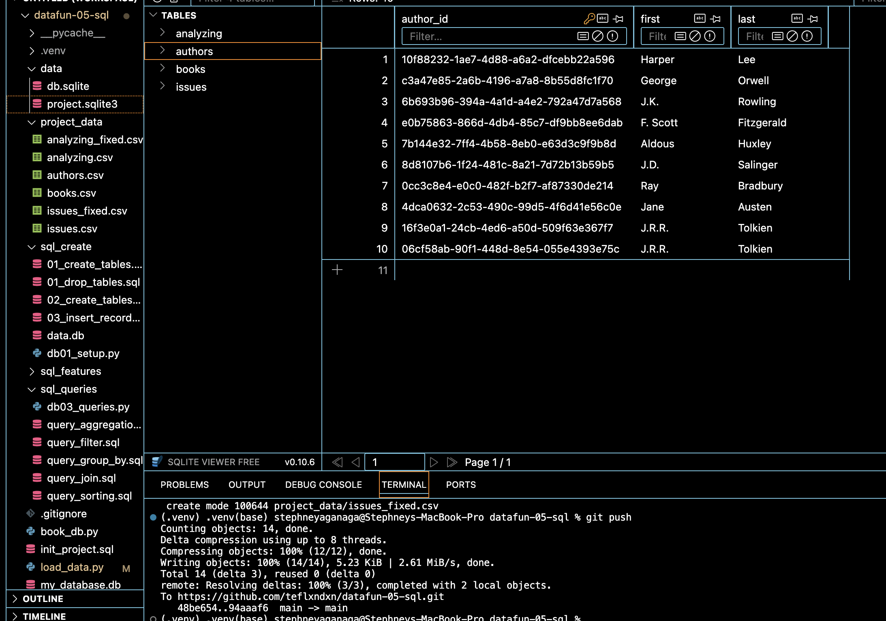

# datafun-05-sql
This project demonstrates integrating Python with SQLite to create, manage, and query a product database. It covers database schema design, CRUD operations via SQL scripts, and automation using Python and pandas for data manipulation and querying.

## Project Structure

## Project Structure

- `sql_create/` : SQL scripts for dropping tables, creating tables, and inserting initial data.
- `sql_features/` : Python scripts and SQL files for performing update and delete operations (feature engineering).
- `sql_queries/` : Python scripts and SQL files for running queries involving aggregation, filtering, grouping, sorting, and joins.
- `data/` : Folder containing the SQLite database file (`my_database.db`).
- `db01_setup.py` : Python script to create the database schema and insert initial sample data.
- `sql_features/db02_features.py` : Python script to execute update and delete SQL operations.
- `sql_queries/db03_queries.py` : Python script to run various SQL queries and display results using pandas.
- `.venv/` : Python virtual environment folder (excluded from git).
- `.gitignore` : Git ignore configuration file.
- `requirements.txt` : Lists Python package dependencies for the project.


## Setup Instructions

1. Clone the repository:

   ```bash
   git clone https://github.com/teflxndxn/datafun-05-sql.git
   cd datafun-05-sql
 


 2. Create and activate a Python virtual environment:

python3 -m venv .venv
source .venv/bin/activate # macOS/Linux
.venv\Scripts\activate # Windows


3. Install dependencies:

pip install -r requirements.txt

4. Run the database setup script to create tables and insert data:

python db01_setup.py

5. Run the features script to update or delete records:

python sql_features/db02_features.py

6. Run the query script to see data querying examples:

python sql_queries/db03_queries.py


## Database Schema

This project uses two related tables:

- `products`  
- `product_id` (Primary Key)  
- `category`  
- `price`  
- `rating`  
- `stock`  

- `sales`  
- `sale_id` (Primary Key)  
- `product_id` (Foreign Key to `products.product_id`)  
- `quantity`  
- `sale_date`  

Foreign key constraints enforce data integrity between products and sales.

## Features

Create and initialize database schema with tables and sample data.
Perform update and delete operations on records using Python and SQL.
Execute SQL queries with:
Filters (e.g., price > 100)
Sorting (e.g., by rating or price)
Grouping and Aggregation (e.g., total quantity sold per product)
Joins (e.g., joining products and sales)
Display results using pandas DataFrames.
Organized modular code using best practices in Python scripting and SQL.


📚 References
This project follows the standard workflow and best practices taught in:

Pro Analytics 01 - Project Initialization
Pro Analytics 01 - Repeatable Workflow
Course Modules: Chapter 9 (Files & Exceptions) and Chapter 17 (SQL & Big Data)

## Books & Authors Database Project

This section of the project demonstrates creating and managing a simple SQLite database with two related tables: `authors` and `books`. It showcases:

- Creating tables with appropriate schema including primary keys (author_id, book_id) and foreign keys (author_id in books).
- Reading data from CSV files (`data/authors.csv` and `data/books.csv`).
- Inserting records into the tables programmatically using Python.
- Adding a new `is_favorite` column to the `books` table and updating records accordingly.
- Querying and displaying combined book and author information, including the favorite status.
- Proper database connection handling and modular Python code.

### Data files

- `data/authors.csv` contains author records with unique IDs, first and last names.
- `data/books.csv` contains book records including book IDs, titles, publication years, and author references.

### How to run

1. Ensure you have the CSV data files in the `data/` folder.
2. Run the Python script to create tables, load data, and display results:

   ```bash
   python book_db.py


 ## CC5.4 Initialize the Database

### Project Structure

- Root folder: `datafun-05-sql`
- Subfolders:
  - `data/` — contains the SQLite database file `project.sqlite3`
  - `project_data/` — contains source CSV files (`authors.csv`, `books.csv`, and the fixed `issues_fixed.csv`, `analyzing_fixed.csv`)
  - `sql/` (optional) — for SQL scripts if needed
- Python script: `load_data.py` in root folder to load data from CSVs into SQLite database

### Database Setup and Data Loading

- Created SQLite database `project.sqlite3` with tables:
  - `authors(author_id TEXT PRIMARY KEY, first TEXT, last TEXT)`
  - `books(book_id TEXT PRIMARY KEY, title TEXT, year_published INTEGER, author_id TEXT)`
  - `issues(issue_id TEXT PRIMARY KEY, title TEXT, category TEXT, status TEXT)`
  - `analyzing(analysis_id TEXT PRIMARY KEY, issue_id TEXT, analyst TEXT, summary TEXT, date_analyzed TEXT)`

- Fixed raw CSV data (`issues_raw.csv`) via Python script inside `load_data.py` to generate clean CSVs (`issues_fixed.csv` and `analyzing_fixed.csv`) with proper columns and formatting

- Used `pandas` and `sqlite3` in `load_data.py` to:
  - Insert authors and books from CSV
  - Load fixed issues and analyzing data into corresponding database tables

- Verified database content using DBeaver SQLite viewer and VS Code SQLite extension

---

## Screenshot

Here’s a screenshot showing the populated database opened in VS Code:



---

## Project Workflow Commands

```bash

# Create and activate virtual environment
python3 -m venv .venv
source .venv/bin/activate  # or .venv\Scripts\activate on Windows

# Install dependencies
pip install pandas

# Run the Python script to clean and load data
python load_data.py

# View the SQLite database in VS Code or another viewer

# Add and commit changes using Git
git add .
git commit -m "Add project setup, data load, screenshot, and workflow commands"
git push origin main
